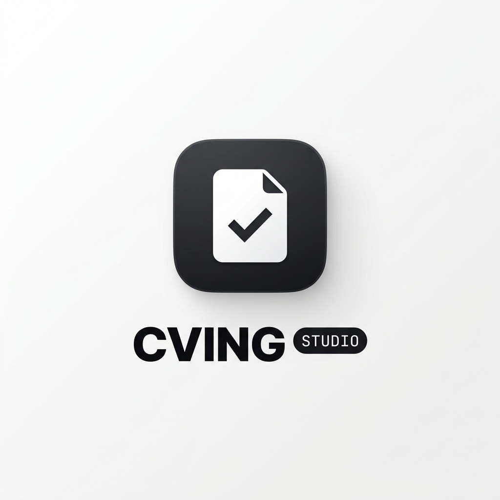

<p align="center">
  
</p>

# CVING STUDIO (시빙 스튜디오)

> **공통 마스터 답변 기반 맞춤형 AI 자기소개서 생성 & 채용공고 정밀 분석 도구**

CVING은 지원자의 공통 마스터 자소서(5대 기본 역량/경험)와 목표 기업의 채용공고(텍스트 또는 스크린샷 캡처)를 결합하여, 기업별 인재상과 직무 요건에 최적화된 맞춤형 자기소개서를 실시간 스트리밍으로 생성해주는 고성능 에디토리얼 웹 애플리케이션입니다.

---

## ✨ 핵심 기능

1. **문항별 순차 분할 스트리밍 (Sequential Per-Question Streaming)**:
   - 5개 문항을 한 번에 요청하지 않고 순차적으로 요청하여 타임아웃 방지, 문항 간 소재/에피소드 중복 원천 차단, 목표 글자수 정밀 준수.
2. **생성 중간 중단 (Lossless Abort)**:
   - 자소서 생성 중 언제든 즉각 중단 가능하며, 지금까지 작성된 내용은 에디터에 안전하게 100% 보존.
3. **유연한 AI Provider & Gateway 연동**:
   - **Google Gemini**: Gemini 3.8 Flash, 2.0 Flash, 1.5 Pro (Google AI Studio 키 / 구독 계정 연동)
   - **Anthropic Claude**: 공식 API 키 (`api.anthropic.com`) 및 AIApiFlow / 사설 Gateway 드롭다운 지원
   - **OpenAI ChatGPT**: 공식 ChatGPT 키 및 사설 프록시 Gateway 드롭다운 지원
4. **멀티모달 Vision OCR 정밀 분석**:
   - 채용공고 캡처 이미지 업로드 또는 클립보드 붙여넣기(`Ctrl+V / Cmd+V`) 즉시 활성화된 AI 모델의 Vision API(또는 클라이언트 Tesseract.js)로 공고 요건 자동 추출.
5. **안전한 브라우저 로컬 저장소**:
   - 모든 답변, 공고, 스크린샷 이미지는 사용자의 브라우저(`LocalStorage` & `IndexedDB`)에만 저장되어 외부로 유출되지 않음.
6. **내보내기 & 일괄 다운로드**:
   - 원클릭 클립보드 복사, 텍스트(`.txt`), 마크다운(`.md`), 전체 회사 자소서 ZIP 일괄 압축 다운로드 지원.

---

## 🛠 기술 스택

- **Frontend**: React 18, TypeScript, Vite
- **Styling**: Tailwind CSS, Lucide React (Linear/Editorial SaaS 디자인 시스템)
- **State Management**: Zustand
- **Storage**: IndexedDB (idb-keyval), LocalStorage
- **OCR Engine**: Multimodal Vision API (Gemini/Claude/OpenAI) + Tesseract.js fallback
- **Export**: JSZip, FileSaver, Canvas-Confetti

---

## 🚀 로컬 실행 방법

```bash
# 1. 의존성 패키지 설치
npm install

# 2. 개발 서버 실행
npm run dev

# 3. 브라우저에서 열기
# http://localhost:5173
```

---

## 🌐 Vercel 배포 안내

1. 본 GitHub 레포지토리를 Vercel(https://vercel.com)에 연결합니다.
2. **Framework Preset**: `Vite` 선택
3. **Build Command**: `npm run build`
4. **Output Directory**: `dist`
5. `[Deploy]` 버튼을 클릭하면 수십 초 내에 전 세계 CDN으로 즉시 배포 완료됩니다.
